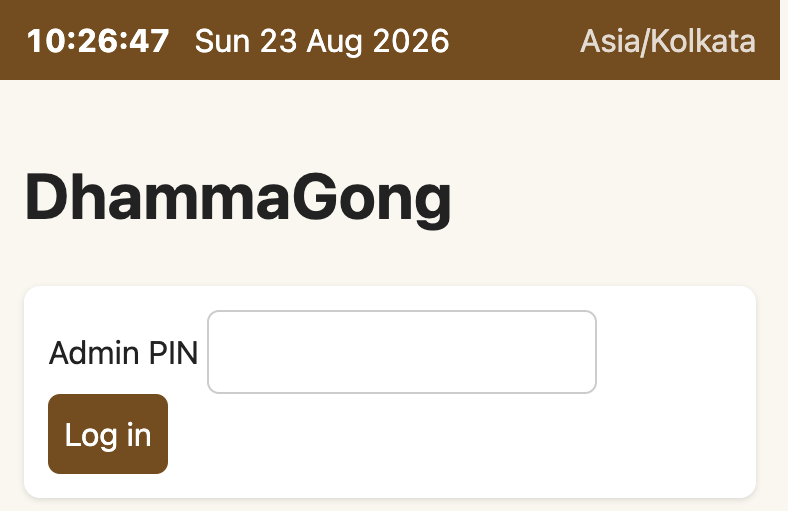
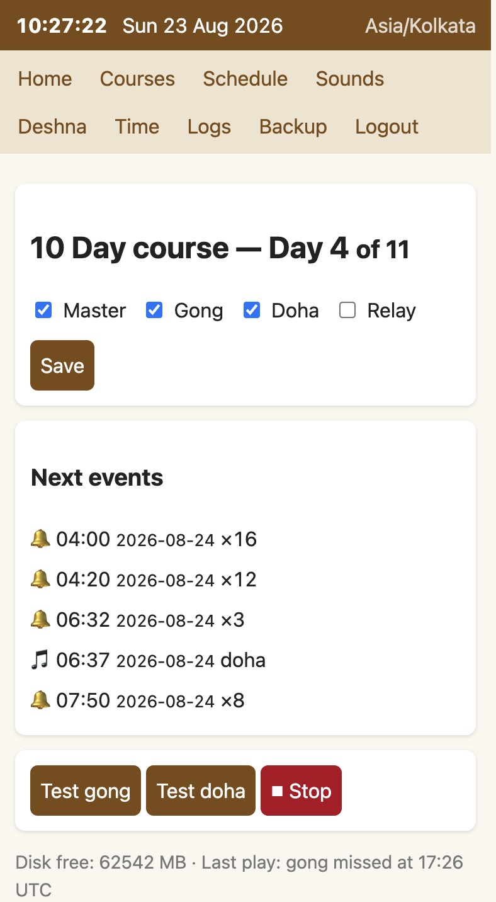
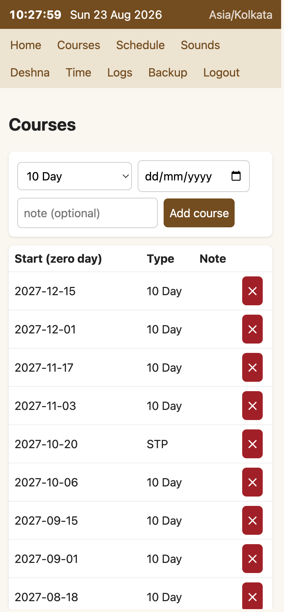
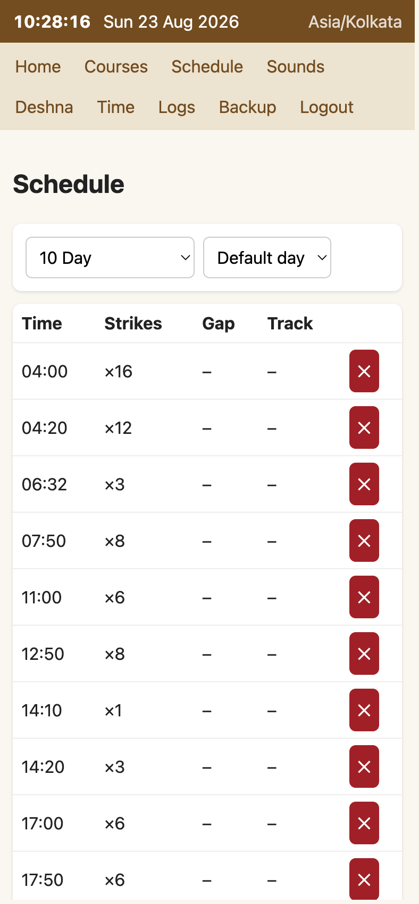
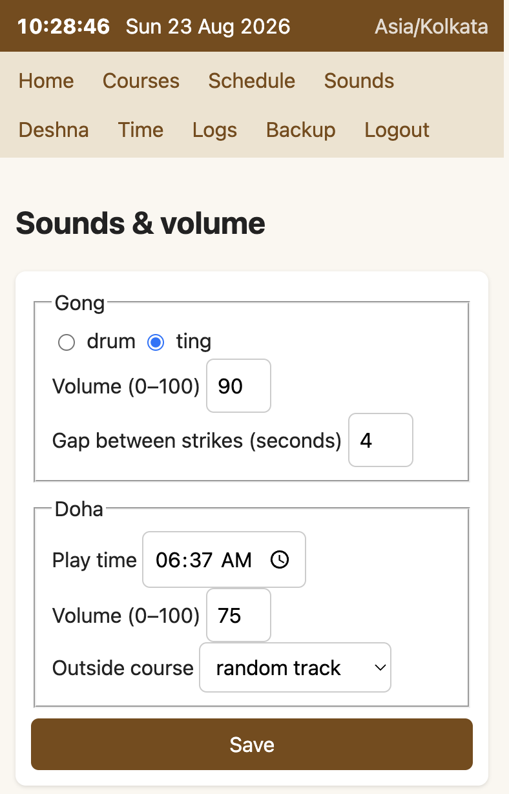
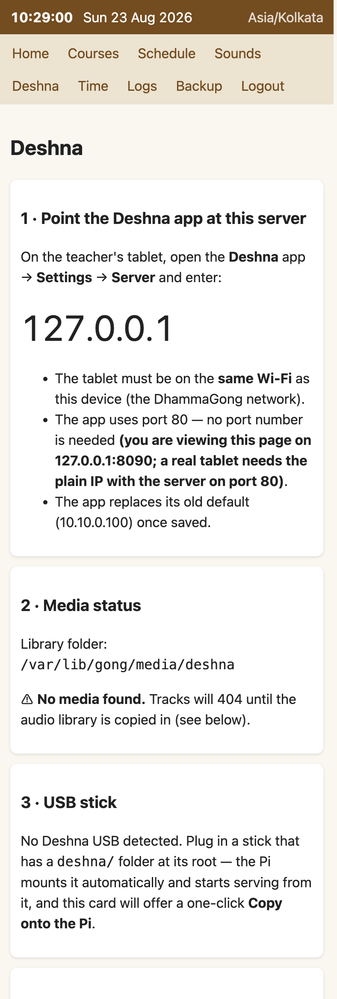
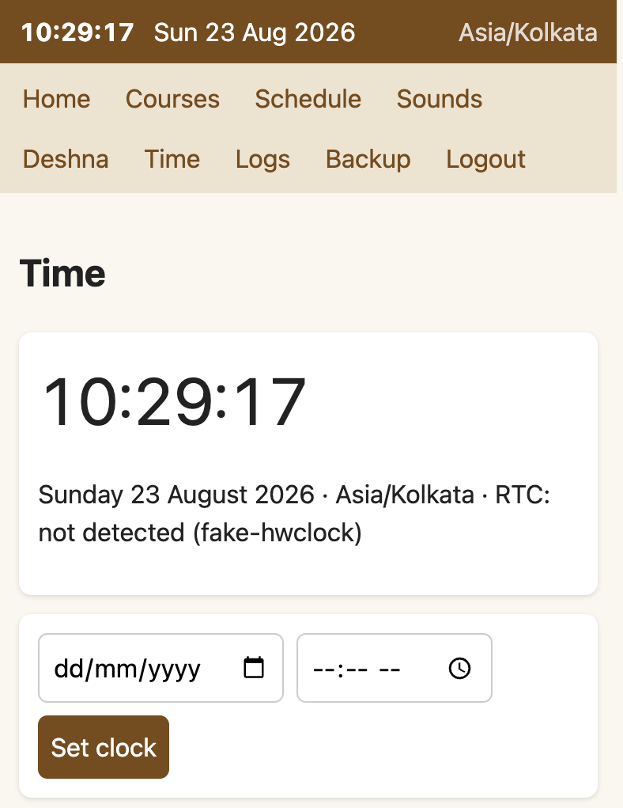
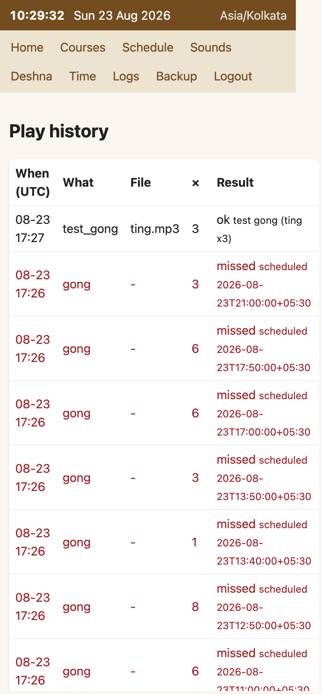
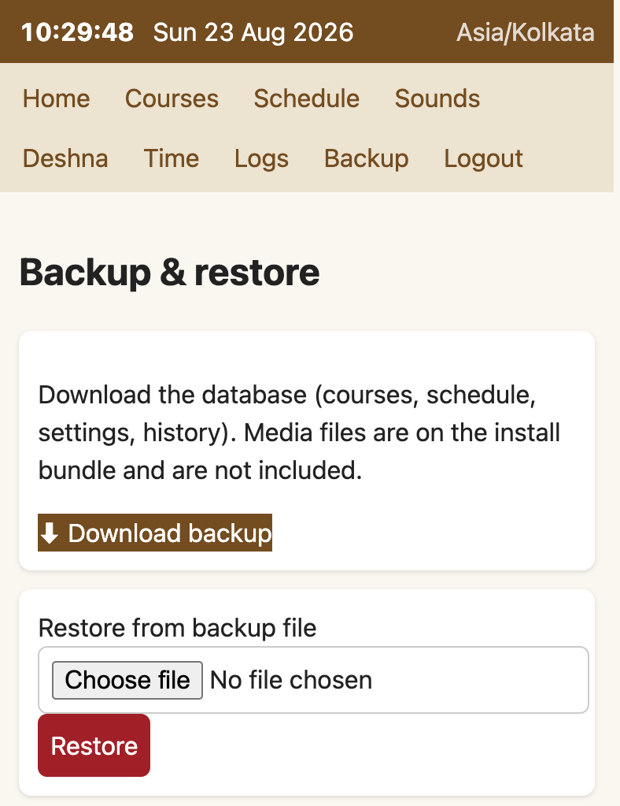

# DhammaGong (Gong-NG)

Raspberry Pi appliance that auto-schedules **gong (bell)** and **doha (MP3)**
playback for Vipassana courses. **`main` is Gong-NG**: one Python daemon
(`gongd`) with a PIN-protected mobile admin UI, SQLite storage, and a
second-accurate scheduler. The older PHP/LAMP stack lives on
[`gong-legacy`](https://github.com/kapaggar/GongDohaServer/tree/gong-legacy).

Design: [`docs/GONG-NG-DESIGN.md`](docs/GONG-NG-DESIGN.md).
Details and local (non-Docker) development: [`ng/README.md`](ng/README.md).

---

## Screenshots

Captured from the Docker demo on `main` (dummy audio, 10 Day course on day 4,
PIN `4321`). Full-size PNGs are in [`docs/screenshots/`](docs/screenshots/).

| | |
|---|---|
| **Login**<br> | **Home** — course day, toggles, next events, test buttons<br> |
| **Courses** — calendar of upcoming courses<br> | **Schedule** — default-day gong times<br> |
| **Schedule, day 4** — explicit day override<br> | **Sounds & volume**<br> |
| **Deshna** — point the tablet at this server, media and USB status<br> | **Time** — clock and RTC status<br> |
| **Logs** — play history; late fires are logged as missed, never played late<br> | **Backup & restore** — one-file SQLite download<br> |

---

## Try it in Docker (no Pi)

Build from this tree and run the same image that produced the screenshots:

```bash
docker build -f ng/docker/Dockerfile -t gong-ng:local .
docker run -d --name gong-ng-demo -p 8090:80 \
  -e GONG_PIN=4321 -e GONG_DEMO=1 \
  -v gong-ng-data:/var/lib/gong \
  gong-ng:local
```

Open http://127.0.0.1:8090/ and log in with PIN **4321**. Audio is dummy
(timed “plays”, no speaker). A published image is documented in
[`docs/DOCKER-HUB-DEMO.md`](docs/DOCKER-HUB-DEMO.md).

```bash
docker logs -f gong-ng-demo    # follow
docker rm -f gong-ng-demo && docker volume rm gong-ng-data   # reset
```

---

## Flash a Raspberry Pi

From a blank microSD: flash Bookworm Lite 64-bit, then pack this repo onto
the card. Firstboot installs from the vendored `ng/firstboot/offline/` pool
(no apt or PyPI on the Pi). Full procedure:
[`docs/GONG-NG-FLASH.md`](docs/GONG-NG-FLASH.md).

```bash
cp ng/firstboot/gong-firstboot.toml.example ng/firstboot/gong-firstboot.toml
# edit Wi-Fi + PIN — never commit the real file
sudo ./ng/firstboot/pack-sd.sh --device /dev/mmcblk0 \
  --toml ng/firstboot/gong-firstboot.toml
```

On the Pi, the UI is `http://<pi-ip>/` (port 80).

---

## Layout

```text
ng/                 gongd, admin UI, firstboot, Docker demo
docs/               flash, design, Docker Hub, screenshots/
app/dhamma/         gong + doha media (used by Gong-NG seed and Docker)
```

---

## Legacy LAMP (not this branch’s product)

The PHP/MariaDB/cron appliance is still in this tree for seed conversion and
media, but it is **maintained on `gong-legacy`**. Installer, Mac LAMP test
harness, and first-boot for that stack:

- [`docs/DEPLOY.md`](docs/DEPLOY.md)
- [`docs/TESTING-ON-MAC.md`](docs/TESTING-ON-MAC.md) (`http://127.0.0.1:8080/`)
- [`docs/FIRSTRUN.md`](docs/FIRSTRUN.md)

---

## License / media

Source, config, installer, schema, and docs are **MIT** — see [LICENSE](LICENSE).

**The audio is not MIT-licensed.** Gong and doha MP3s under `app/dhamma/`
remain the property of their original rights holders. Redistribute them only
as those rights holders permit.
