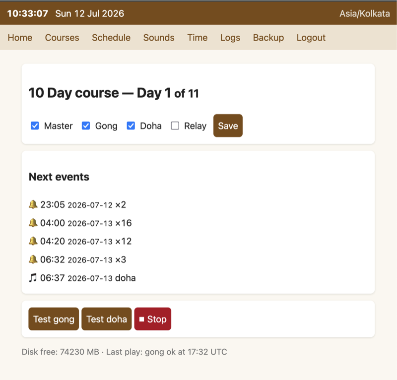
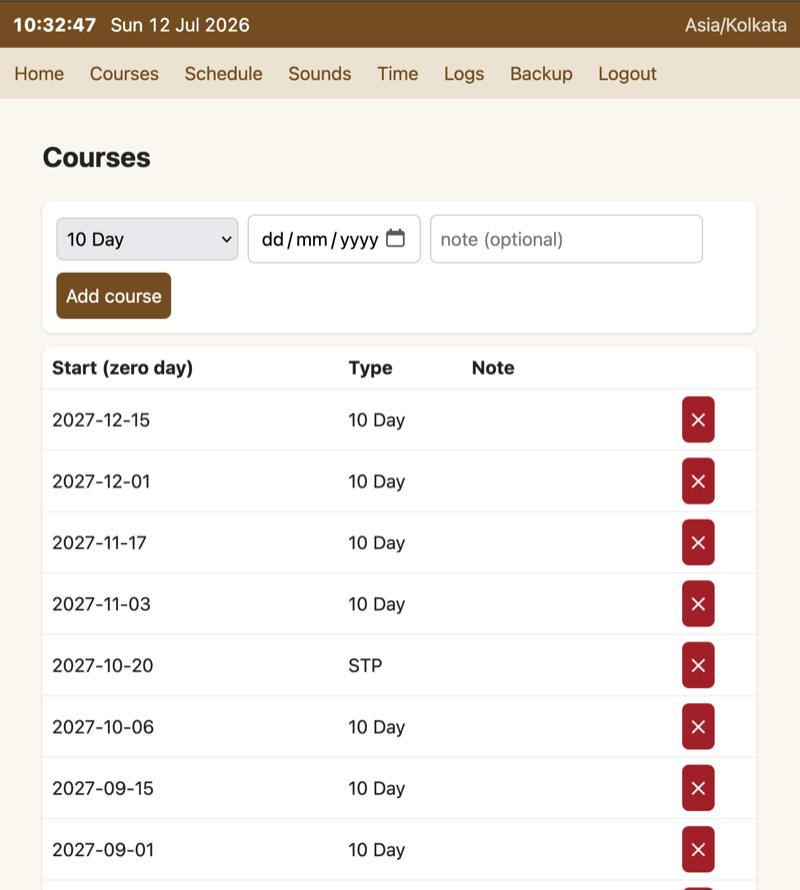
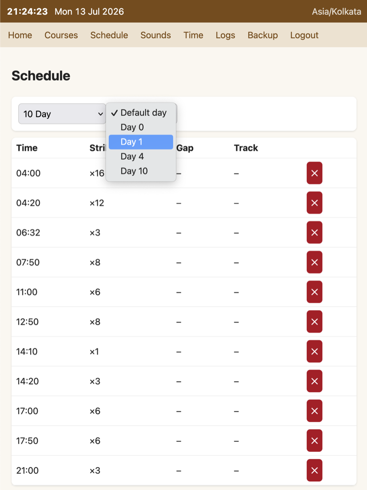
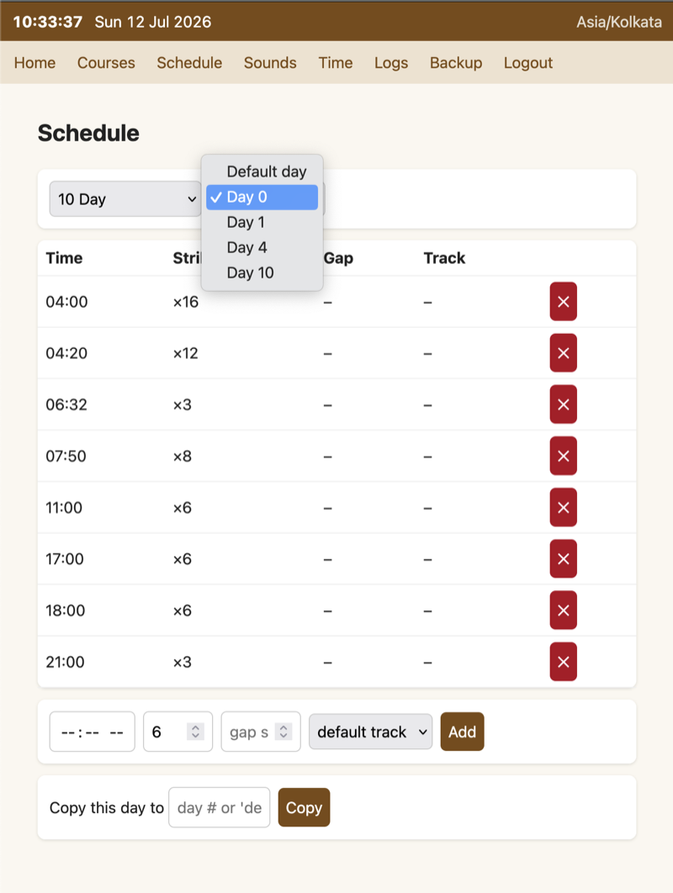
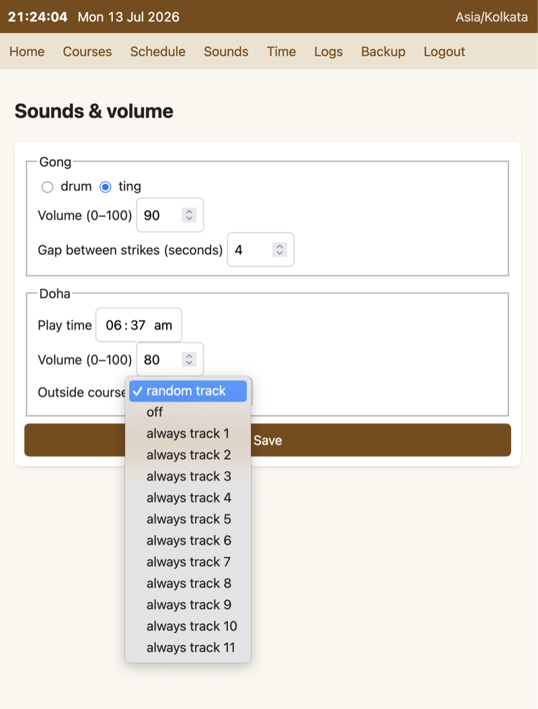
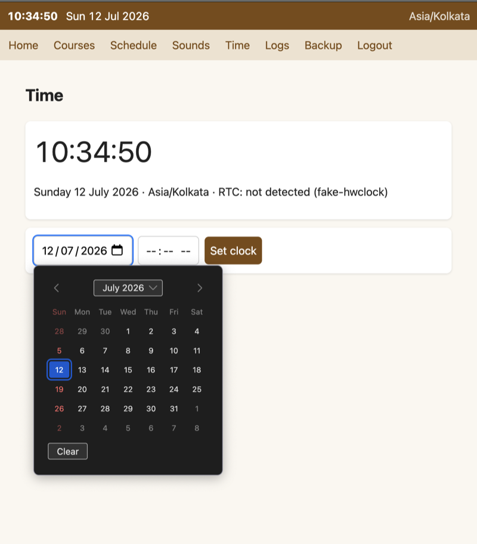
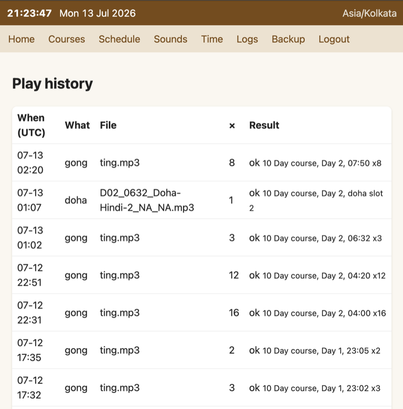
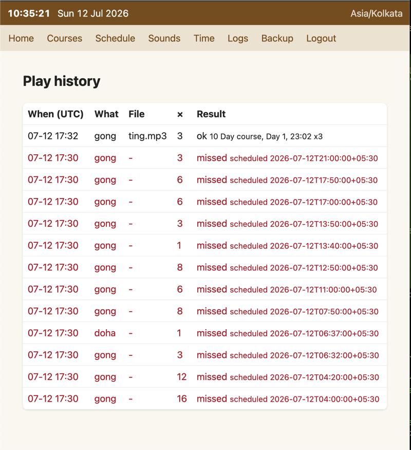
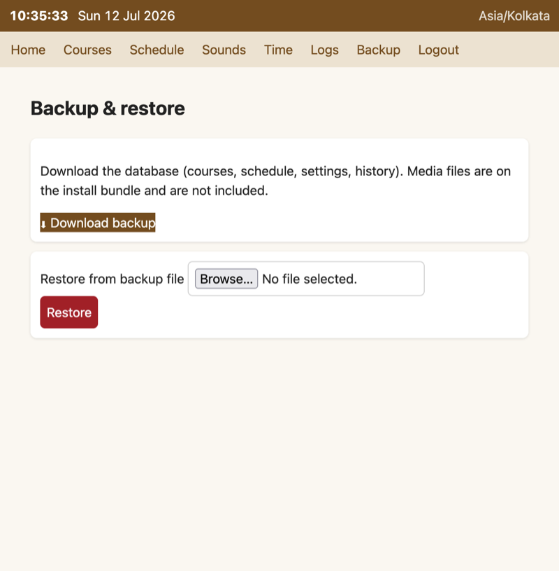

# Gong-NG

Next-generation Gongserver: one Python daemon (`gongd`) that schedules gong
and doha playback second-accurately, drives the amplifier relay, and serves a
PIN-protected mobile admin UI. SQLite storage, fresh-install deployment, no
internet ever required. Full design: [`../docs/GONG-NG-DESIGN.md`](../docs/GONG-NG-DESIGN.md).

## Status

- **Done (M1+M2):** core daemon, scheduler, player, doha selection, seed
  conversion from the legacy dump, admin UI + JSON API, `gongctl`, unit tests.
- **Not yet validated on hardware (M0):** ALSA device name, relay boot-glitch,
  NetworkManager AP mode, DS3231. Run `tools/hw-spike.sh` on a Pi first.
- **Not built yet (M3):** the offline install bundle builder; `firstboot/firstrun.sh`
  documents the target flow but has not run on a real card.

## Screenshots

Admin UI running against the Docker demo (dummy audio, 10 Day course active).

| | |
|---|---|
| **Dashboard** — course day, toggles, next events, test buttons<br> | **Courses** — the seeded Dhamma Sudha calendar<br> |
| **Schedule editor** — per-day gong times<br> | **Day picker** — explicit days override the default pattern<br> |
| **Sounds & volume** — track, volumes, doha time and outside-course mode<br> | **Time** — set clock, RTC status<br> |
| **Play history** — every fire logged with result<br> | **Missed events** — late fires are skipped, never blasted late<br> |
| **Backup & restore** — one-file DB download<br> | |

## Develop on a Mac/PC (no hardware)

```bash
cd ng
python3 -m venv .venv && .venv/bin/pip install -e '.[dev]'
.venv/bin/pytest                          # 65 tests

export GONG_DATA_DIR=/tmp/gongdata GONG_CONFIG=/nonexistent
bin/gongctl init                          # schema + seed + media from ../app
bin/gongctl reset-pin --pin 4321
bin/gongctl simulate --course "10 Day" --start 2026-08-01
bin/gongctl status --check

# run the daemon with dummy audio on http://127.0.0.1:8090/
printf '[audio]\nplayer="dummy"\n[web]\nlisten="127.0.0.1:8090"\n' > /tmp/dev.toml
GONG_CONFIG=/tmp/dev.toml .venv/bin/python -m gong_ng
```

## Layout

```
gong_ng/            the daemon: scheduler.py player.py clock.py doha.py
gong_ng/web/        Flask admin UI + API (design §8)
bin/                gongctl, gong-settime (sudo helper), gong-smoke-check
seed/               seed.sql + doha-manifest.json — GENERATED, do not edit
tools/              convert_legacy_seed.py (build-time), hw-spike.sh (M0)
systemd/ os/        units, sudoers, nftables, config.toml.example
firstboot/          firstrun.sh + gong-firstboot.toml.example (M3)
tests/              pytest suite; test_seed.py pins seed.sql to db/gong.sql
```

## Deshna responder (fetch.php compat)

gongd also answers for the legacy **Deshna** appliance — the course-audio
jukebox queried by the Deshna Android app (dhamma.org.deshna). The contract
was reconstructed from the decompiled app (dn3.1) since the original
fetch.php is lost:

```
GET /fetch.php?a=<track_id>|<course_lang_code>|<ip_hash>|<selected_lang>
     ip_hash = md5("<client-ip>-dowifi")        # same weak token as legacy
  -> 200 audio/mpeg (the file), 403 bad hash, 404 unknown id / missing media
```

- `seed/deshna-seed.sql` — 30 courses + 3,716 schedule rows, the union of the
  Deshna Pi's MySQL dump and the app's bundled DB (app revision wins on
  conflicts; ids are the contract with the app — never renumber). Regenerate:
  `tools/convert_deshna_seed.py --dump deshna.sql --apk-db assets/deshna.db`.
- Audio library goes at `/var/lib/gong/media/deshna/<filename>` (paths as in
  the schedule, e.g. `10-day/Hi-En/D01_0800_GS_Hi-En_10d.mp3`); the endpoint
  404s harmlessly until media is copied there.
- Reconstruction caveat: for `multiple`-language tracks, `selected_lang`
  picks the sibling row with that lang code — behaviour for the common
  (single-language) case is exact, this branch is best-effort.
- Point the app's server setting at the gong Pi (legacy default 10.10.0.100).

## Key invariants (enforced by tests)

- Doha selection is byte-for-byte the legacy algorithm (`test_doha.py`).
- `seed/seed.sql` must equal the converter output for `../db/gong.sql`
  (`test_seed.py`); re-run `tools/convert_legacy_seed.py` after any change.
- The scheduler never fires early, never double-fires across restarts, fires
  ≤ `fire_grace_seconds` late, and logs `missed` beyond that.
- A clock that went backwards suppresses all automatic playback until staff
  confirm the time (red banner in the UI).

## Break-glass

Forgot the PIN: SSH in, `sudo /opt/gong-ng/bin/gongctl reset-pin`.
